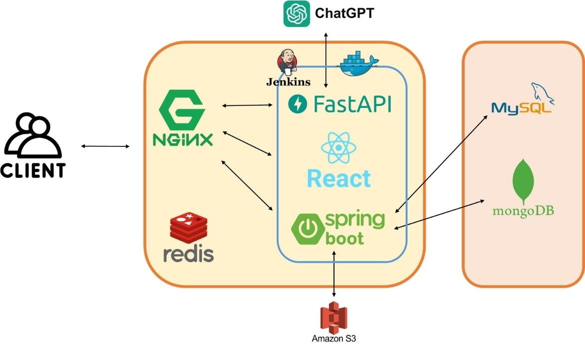
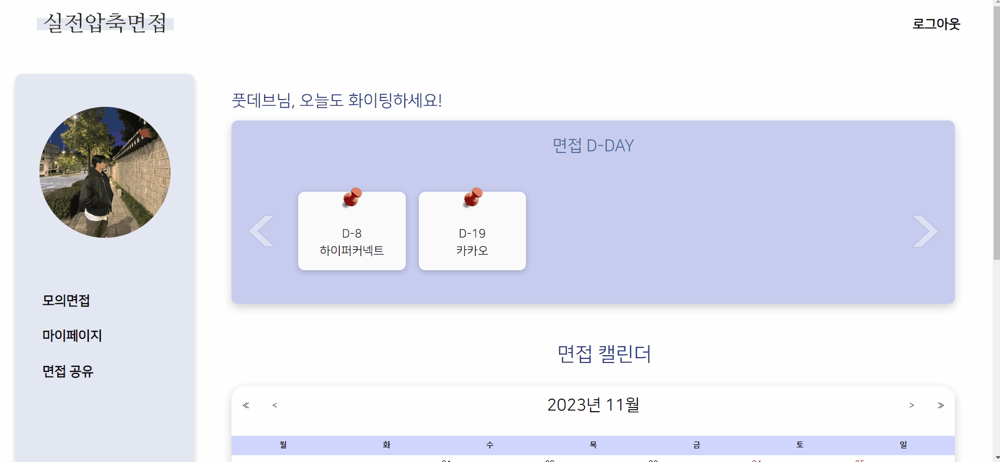
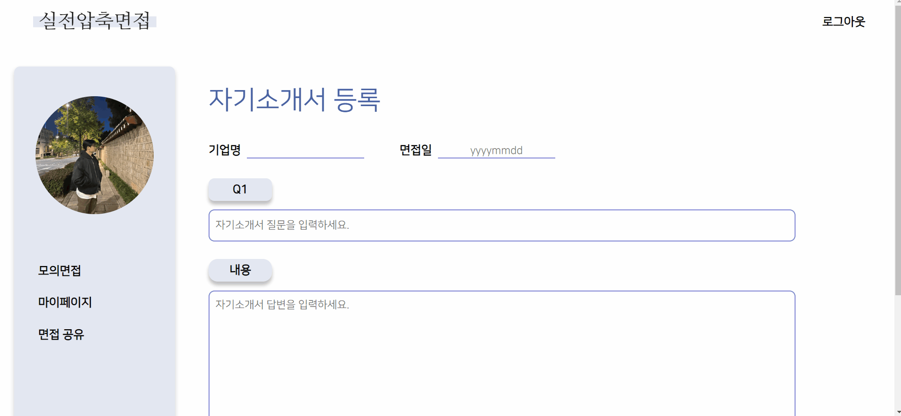

# 실전 압축 면접(실압면)
 > **ChatGPT, STT, TTS를 활용한 모의면접 서비스**
<br>
> 개발 기간 : 2023.10.09 ~2023.11.17


## 📃 문서
> | [요구사항 정의서](https://fixed-crater-6a0.notion.site/6b3711c806744af0b92856fb73e5207d?pvs=4)
| [기능 명세서](https://www.notion.so/5998483e94754377be0dbb4933324076?pvs=4)
| [피그마](https://www.figma.com/file/glrcIrx3hFETq4PgP8wHR1/%EC%99%80%EC%9D%B4%EC%96%B4%ED%94%84%EB%A0%88%EC%9E%84?type=design&node-id=0-1&mode=design&t=S3B5aodiF6ypW7h3-0)
| [ERD Cloud](https://www.erdcloud.com/d/J5PZXvAnuG5PkqsBa)
| [API 명세서](https://fixed-crater-6a0.notion.site/API-a10ee7adc00a4b4d894c400f117365c8?pvs=4)

## 🌞 목차
1. [서비스 소개](#🧏🏻‍♂️-서비스-소개)
2. [기술 스택](#📍-기술-스택)
3. [협업 툴](#🧩-협업-툴)
4. [파일 구조]()
5. [시스템 아키텍처](#🕸-시스템-아키텍쳐)
6. [기능 소개](#🔍기능-소개)

## 🧏🏻‍♂️ 서비스 소개
- 모의 면접
  - 연습 면접, 실전 면접, 자율 면접 세가지 유형에 따라 연습해 볼 수 있습니다.
  - 자기소개서에 기반한 개인 맞춤형 질문, 기술 면접과 인성 면접에 대비한 질문을 GPT 프롬프트 엔지니어링을 통해 제공합니다.

- 자기소개서 관리
  - 자기소개서를 등록하고 개인 면접 일정을  관리할 수 있습니다.

- 면접 레포트 제공
  - 실전 면접 종료 시 면접 영상과 질문, 답변을 포함한 리포트가 제공됩니다. 
  
- 커뮤니티를 통한 면접 피드백
  - 리포트를 커뮤니티에 올려 답변에 대한 피드백을 받고 정보를 교류할 수 있습니다.

## 📍 기술 스택
- Front-End
  - npm 9.6.7
  - Node.js 18.16.1
  - React 18.2.0
  - React-Calendar 4.6.1
  - React-Webcam 7.2.0
  - Recoil 0.7.7
  - React-Speech-Recognition 3.10.0
- Back-End
  - Java 11
  - SpringBoot 2.7.13
  - FastAPI 0.104.0
  - uvicon 0.24.0
- DB
  - MySQL 8.0
  - Redis 5.0.7
  - MongoDB 4.4.25  
- Infra
  - Amazon EC2
  - Docker
  - Jenkins
  - Nginx
  - SSL

## 🧩 협업 툴
- Git
- Jira
- Discord
- Notion
- Figma
- MatterMost
- Visual Studio Live Share
- Code With Me

## 파일 구조
### Front-End
```
📦src
 ┣ 📂api
 ┣ 📂app
 ┣ 📂assets
 ┃ ┣ 📂button
 ┃ ┣ 📂provider
 ┣ 📂atoms
 ┣ 📂components
 ┃ ┣ 📂Card
 ┃ ┣ 📂Comment
 ┃ ┣ 📂commons
 ┃ ┣ 📂interview
 ┃ ┣ 📂modal
 ┃ ┣ 📂Report
 ┃ ┣ 📂resume
 ┃ ┣ 📂review
 ┣ 📂features
 ┃ ┗ 📂counter
 ┣ 📂fonts
 ┣ 📂hooks
 ┣ 📂pages
 ┃ ┣ 📂Board
 ┃ ┣ 📂Home
 ┃ ┣ 📂report
 ┃ ┣ 📂resume
 ┃ ┣ 📂review
 ┣ 📂Recoil
 ┣ 📂Routes
 ┣ 📂styles
 ┣ 📂utils
```
### Back-End
```
📦src
 ┣ 📂main
 ┃ ┗ 📂java
 ┃ ┃ ┗ 📂com
 ┃ ┃ ┃ ┗ 📂b107
 ┃ ┃ ┃ ┃ ┗ 📂interview
 ┃ ┃ ┃ ┃ ┃ ┣ 📂commons
 ┃ ┃ ┃ ┃ ┃ ┃ ┣ 📂exception
 ┃ ┃ ┃ ┃ ┃ ┃ ┣ 📂image
 ┃ ┃ ┃ ┃ ┃ ┃ ┃ ┣ 📂dto
 ┃ ┃ ┃ ┃ ┃ ┃ ┣ 📂notification
 ┃ ┃ ┃ ┃ ┃ ┃ ┣ 📂properties
 ┃ ┃ ┃ ┃ ┃ ┃ ┣ 📂security
 ┃ ┃ ┃ ┃ ┃ ┃ ┃ ┣ 📂config
 ┃ ┃ ┃ ┃ ┃ ┃ ┃ ┃ ┣ 📂handler
 ┃ ┃ ┃ ┃ ┃ ┃ ┃ ┣ 📂dao
 ┃ ┃ ┃ ┃ ┃ ┃ ┃ ┣ 📂dto
 ┃ ┃ ┃ ┃ ┃ ┃ ┃ ┣ 📂filter
 ┃ ┃ ┃ ┃ ┃ ┃ ┃ ┗ 📂service
 ┃ ┃ ┃ ┃ ┃ ┃ ┗ 📂support
 ┃ ┃ ┃ ┃ ┃ ┣ 📂domain
 ┃ ┃ ┃ ┃ ┃ ┃ ┣ 📂board
 ┃ ┃ ┃ ┃ ┃ ┃ ┃ ┣ 📂controller
 ┃ ┃ ┃ ┃ ┃ ┃ ┃ ┣ 📂dto
 ┃ ┃ ┃ ┃ ┃ ┃ ┃ ┣ 📂entity
 ┃ ┃ ┃ ┃ ┃ ┃ ┃ ┣ 📂mapper
 ┃ ┃ ┃ ┃ ┃ ┃ ┃ ┣ 📂repository
 ┃ ┃ ┃ ┃ ┃ ┃ ┃ ┗ 📂service
 ┃ ┃ ┃ ┃ ┃ ┃ ┣ 📂comment
 ┃ ┃ ┃ ┃ ┃ ┃ ┃ ┣ 📂controller
 ┃ ┃ ┃ ┃ ┃ ┃ ┃ ┣ 📂dto
 ┃ ┃ ┃ ┃ ┃ ┃ ┃ ┣ 📂entity
 ┃ ┃ ┃ ┃ ┃ ┃ ┃ ┣ 📂mapper
 ┃ ┃ ┃ ┃ ┃ ┃ ┃ ┣ 📂repository
 ┃ ┃ ┃ ┃ ┃ ┃ ┃ ┗ 📂service
 ┃ ┃ ┃ ┃ ┃ ┃ ┣ 📂config
 ┃ ┃ ┃ ┃ ┃ ┃ ┣ 📂report
 ┃ ┃ ┃ ┃ ┃ ┃ ┃ ┣ 📂controller
 ┃ ┃ ┃ ┃ ┃ ┃ ┃ ┣ 📂dto
 ┃ ┃ ┃ ┃ ┃ ┃ ┃ ┃ ┣ 📂request
 ┃ ┃ ┃ ┃ ┃ ┃ ┃ ┃ ┗ 📂response
 ┃ ┃ ┃ ┃ ┃ ┃ ┃ ┣ 📂entity
 ┃ ┃ ┃ ┃ ┃ ┃ ┃ ┣ 📂repository
 ┃ ┃ ┃ ┃ ┃ ┃ ┃ ┗ 📂service
 ┃ ┃ ┃ ┃ ┃ ┃ ┣ 📂resume
 ┃ ┃ ┃ ┃ ┃ ┃ ┃ ┣ 📂controller
 ┃ ┃ ┃ ┃ ┃ ┃ ┃ ┣ 📂dto
 ┃ ┃ ┃ ┃ ┃ ┃ ┃ ┃ ┣ 📂request
 ┃ ┃ ┃ ┃ ┃ ┃ ┃ ┃ ┗ 📂response
 ┃ ┃ ┃ ┃ ┃ ┃ ┃ ┣ 📂entity
 ┃ ┃ ┃ ┃ ┃ ┃ ┃ ┣ 📂mapper
 ┃ ┃ ┃ ┃ ┃ ┃ ┃ ┣ 📂repository
 ┃ ┃ ┃ ┃ ┃ ┃ ┃ ┗ 📂service
 ┃ ┃ ┃ ┃ ┃ ┃ ┣ 📂review
 ┃ ┃ ┃ ┃ ┃ ┃ ┃ ┣ 📂controller
 ┃ ┃ ┃ ┃ ┃ ┃ ┃ ┣ 📂dto
 ┃ ┃ ┃ ┃ ┃ ┃ ┃ ┃ ┣ 📂request
 ┃ ┃ ┃ ┃ ┃ ┃ ┃ ┃ ┗ 📂response
 ┃ ┃ ┃ ┃ ┃ ┃ ┃ ┣ 📂entity
 ┃ ┃ ┃ ┃ ┃ ┃ ┃ ┣ 📂mapper
 ┃ ┃ ┃ ┃ ┃ ┃ ┃ ┣ 📂repository
 ┃ ┃ ┃ ┃ ┃ ┃ ┃ ┗ 📂service
 ┃ ┃ ┃ ┃ ┃ ┃ ┗ 📂user
 ┃ ┃ ┃ ┃ ┃ ┃ ┃ ┣ 📂controller
 ┃ ┃ ┃ ┃ ┃ ┃ ┃ ┣ 📂dto
 ┃ ┃ ┃ ┃ ┃ ┃ ┃ ┃ ┣ 📂request
 ┃ ┃ ┃ ┃ ┃ ┃ ┃ ┃ ┗ 📂response
 ┃ ┃ ┃ ┃ ┃ ┃ ┃ ┣ 📂entity
 ┃ ┃ ┃ ┃ ┃ ┃ ┃ ┣ 📂mapper
 ┃ ┃ ┃ ┃ ┃ ┃ ┃ ┣ 📂repository
 ┃ ┃ ┃ ┃ ┃ ┃ ┃ ┗ 📂service
 ┃ ┃ ┃ ┃ ┃ ┣ 📂util
 ┗ 📂test
 ┃ ┗ 📂java
 ┃ ┃ ┗ 📂com
 ┃ ┃ ┃ ┗ 📂b107
 ┃ ┃ ┃ ┃ ┗ 📂interview
 ┃ ┃ ┃ ┃ ┃ ┣ 📂domain
 ┃ ┃ ┃ ┃ ┃ ┃ ┗ 📂report
 ┃ ┃ ┃ ┃ ┃ ┃ ┃ ┣ 📂controller
 ┃ ┃ ┃ ┃ ┃ ┃ ┃ ┣ 📂repository
 ┃ ┃ ┃ ┃ ┃ ┃ ┃ ┗ 📂service
 ┃ ┃ ┃ ┃ ┃ ┣ 📂util
```

## 🕸 시스템 아키텍쳐
- Refresh Token 저장소로 redis를 선택
- GPT 서비스를 FastAPI 프레임워크를 통해 제공
- Nginx를 통한 리버스 프록싱, https 보안 설정
- 레포트 정보를 read, write를 RDB 보다 더 빠르게 하기 위해 MongoDB 선택
- 도커 컨테이너를 사용한 운영환경 분리 및 배포
- 영상 저장을 위한 Amazon S3 저장소 사용
   


## 🔍기능 소개

### 모의 면접
- 모의 면접, 자율 면접, 연습 면접 3가지 모드를 통하여 면접을 대비할 수 있습니다.
- 자소서 기반, 기술 면접, 인성 면접 등으로 면접의 유형을 선택할 수 있습니다.


### 면접 레포트
- 모의 면접을 통해 생성된 레포트를 통해 면접 복기 및 피드백을 할 수 있습니다.


### 면접 캘린더
- 자기소개서를 등록할 때 입력한 면접일자를 바탕으로 면접 일정을 확인할 수 있습니다.


<br>


### 자기소개서 관리

#### 자기소개서 등록
- 면접을 대비하려는 기업의 자기소개서를 등록할 수 있습니다.
- 면접일자도 같이 등록하여 면접 캘린더에서 확인할 수 있습니다.



#### 자기소개서 수정 & 삭제
- 자기소개서의 내용을 수정하거나 삭제를 할 수 있습니다.


### 커뮤니티 서비스
- 모의 면접을 통해 제공된 레포트를 커뮤니티에 올려 다른 사람들에게 댓글을 통해 피드백 받거나 답변에 대해 토론할 수 있습니다.


<!-- Markdown link & img dfn's -->
[npm-image]: https://img.shields.io/npm/v/datadog-metrics.svg?style=flat-square
[npm-url]: https://npmjs.org/package/datadog-metrics
[npm-downloads]: https://img.shields.io/npm/dm/datadog-metrics.svg?style=flat-square
[travis-image]: https://img.shields.io/travis/dbader/node-datadog-metrics/master.svg?style=flat-square
[travis-url]: https://travis-ci.org/dbader/node-datadog-metrics
[wiki]: https://github.com/yourname/yourproject/wiki

## 🙋🏻‍♂️ 팀원
|                  박재현                   |                      김현수                       |               박대화                |               이서연                |               안도희               |                    박영기                     |
| :---------------------------------------: | :-----------------------------------------------: | :---------------------------------: | :---------------------------------: | :--------------------------------: | :-------------------------------------------: |
|         |                 |   |   |  |             |
|                 BE/FE                  |                     BE/FE                      |              BE/FE               |              BE/FE               |              BE/FE              |                   BE/FE                    |
| [Park-Jaehyeon98](https://github.com/Park-Jaehyeon98) | [footdev](https://github.com/footdev) | [daehwa-park](https://github.com/daehwa-park) | [sylee723](https://github.com/sylee723) |[dohee-Ahn](https://github.com/doheeahn)   | [park-yeong-ki](https://github.com/park-yeong-ki) |
